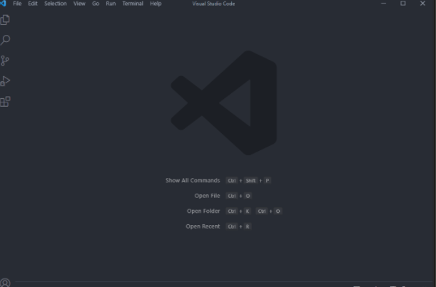

# Lab Report 1 - CSE 15L
## How to log into a course-specific account on ieng6.
### Jordan Nishi A16201086

**Step 1 - Installing VScode**
Go to `https://code.visualstudio.com/` and click the Download button. Once you do
you should see a screen that looks like this:

**Step 2 - Remotely Connecting**
To remotely connect, open the terminal in VSCode using `ctrl+` and then
type the command `ssh cs15lwi22zz@ieng6.ucsd.edu` but
replace the "zz" with the characters of your account.

Then type `yes` and press enter.

Enter in your password (UCSD SSO) and you should be brought to this: 

**Step 3 - Trying Some Commands**
Try some commands such as `cd ~`, `cd`, `ls`, `ls -lat`, and `ls -a`. These are some
commands that let you navigate the directory. The functionalities of them are
listed below:

**Step 4 - Moving Files with scp**
The command `scp` lets us copy a file from our computer to a remote one. If
I have a file named WhereAmI.java

Run the command `scp WhereAmI.java cs15lwi22zz@ieng6.ucsd.edu:~/` where you
replace the "zz" with your username characters.

If you login with `ssh` and use `ls`, you should be able to see the WhereAmI.java
file there!

Try using `java` and `javac` and you should get this:

**Step 5 - Setting an SSH Key**
To make logging into the server easier, we can generate an SSH key. On Windows,
if you use the command `ssh-keygen -t ed25519`, you can create a key to make 
the login process quicker.

Now if you try `ssh cs15lwi22aqh@ieng.ucsd.edu` you shouldn't have to enter
your password.

**Step 6- Optimizing Remote Running**
Lasty, we can optimize our remote running even more with some tricks.

The first one is that we can write a command in quotes at the end of an `ssh`
command to run it on the remote server and then exit like so:

We can also run multiple commands on the same line by separating them with
semicolons like so:
