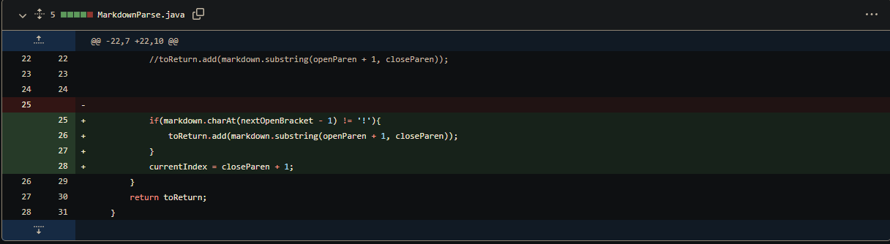
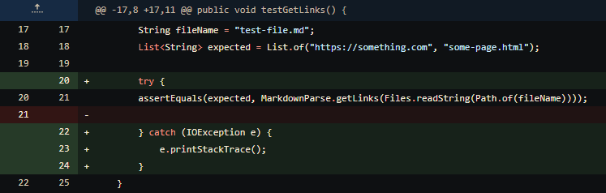
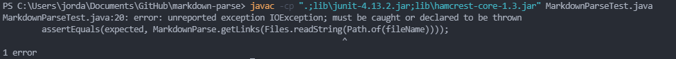
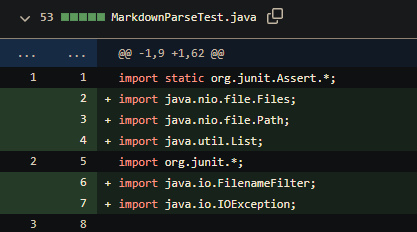
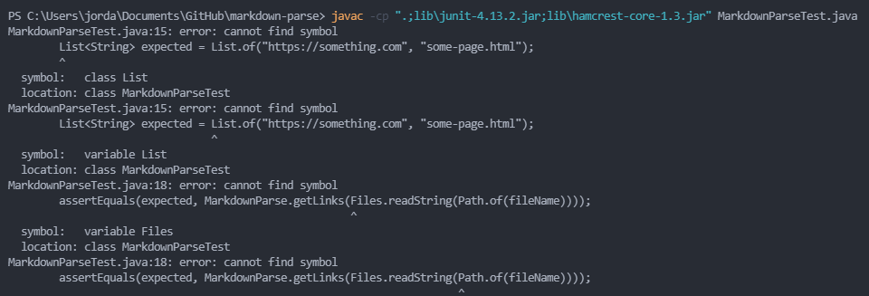

# Lab Report 2 - CSE 15L
## Three Bugs and How We Fixed Them
### Jordan Nishi A16201086

**Bug 1 - Dealing With Images**

Bug Fix:

[Link to Test File - test-lab-3.md](https://github.com/jordan-nishi/markdown-parse/blob/main/test-lab-3.md)

Failure:

Our failure-inducing input comes test-lab-3.md when we try to run MarkdownParse.The symptom can be seen in the failure image, as our program should not be printing out this link as it is defined as an image by the markdown. Our bug was that we didn't include a check to determine if the link was an image or not. After adding this bug fix, the program worked as expected.

**Bug 2 - Try Catch Blocks in JUnit Tests**

Bug Fix:

[Link to File Test File - test-file.md](https://github.com/jordan-nishi/markdown-parse/blob/main/test-file.md)

Failure:

The failure-inducing input arises when we try to run one of our JUnit tests in MarkdownParseTest.java on the file test-file-md. The symptom it gave can be seen in the failure image, where it tells us that there was an unreported IOException. To fix this bug, we had to add a try-catch block to account for when an IOException happens.

**Bug 3 - Importing Necessary Utilities**

Bug Fix:

[Link to File - MarkdownParseTest.java](https://github.com/jordan-nishi/markdown-parse/blob/main/MarkdownParseTest.java)

Failure:

The failure-inducing input arises when we try to compile MarkdownParseTest.java. The symptoms that it shows
tells us that there are missing symbols and that (not shown in the screenshot) "Files" and "Path" cannot be
resolved. This led us to fixing this bug by importing the necessary utilities such as java.nio.file.Files, java.nio.file.Path, java.util.List, java.io.FilenameFilter, and java.io.IOException.
