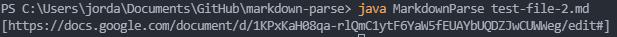

# Lab Report 2 - CSE 15L
## Three Bugs and How We Fixed Them
### Jordan Nishi A16201086

**Bug 1 - Dealing With Images**

Bug Fix:

[Link to Test File - test-lab-3.md](https://github.com/jordan-nishi/markdown-parse/blob/main/test-lab-3.md)

Failure:

Our failure-inducing input comes test-lab-3.md when we try to run MarkdownParse.The symptom can be seen in the failure image, as our program should not be printing out this link as it is defined as an image by the markdown. Our bug was that we didn't include a check to determine if the link was an image or not. After adding this bug fix, the program worked as expected.

**Bug 2 - Try Catch Blocks in JUnit Tests**

Bug Fix:

[Link to File Test File - test-file.md](https://github.com/jordan-nishi/markdown-parse/blob/main/test-file.md)

Failure:

The failure-inducing input arises when we try to run one of our JUnit tests in MarkdownParseTest.java on the file test-file-md. The symptom it gave can be seen in the failure image, where it tells us that there was an unreported IOException. To fix this bug, we had to add a try-catch block to account for when an IOException happens.

**Bug 3 - Out of Bounds Error**

Bug Fix:

[Link to File - test-lab-4.md](https://github.com/jordan-nishi/markdown-parse/blob/main/test-lab-4.md)

Failure:

The failure-inducing input arises when we try to run MarkdownParse.java with
test-lab-4.md. The symptom we get is that there is an index out of bounds exception.
The reason this happens is because one of our if statements checks for an "!"
before the first open bracket, however, this md file has nothing before the bracket, leading
to an index out of bounds exception. To fix this, we added another check to the if 
statement to pass only if the open bracket isn't at position 0.
