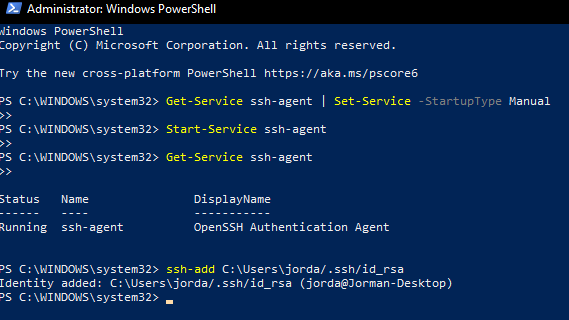
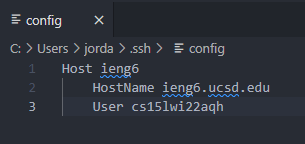
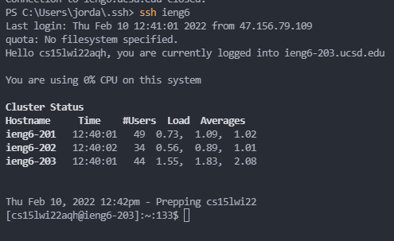
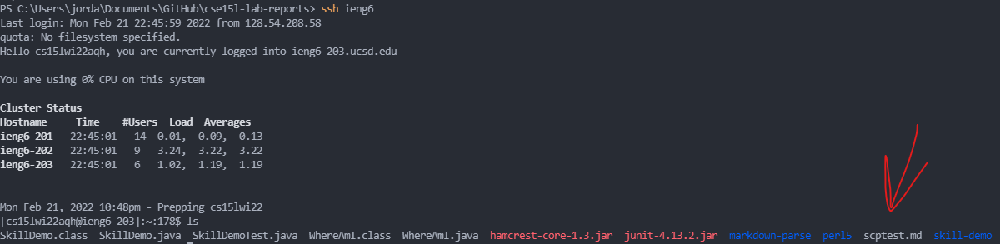

# Lab Report 3 - CSE 15L
## Group Choice Activity - Streamlining SSH
### Jordan Nishi A16201086

When I was attempting this choice, I realized that I actually had never set up
the ssh keygen correctly. The reason for this is because since I'm on Windows
the process is a bit more convoluted than on Mac/Linux. 

The way I fixed it is through opening the Windows Powershell Application 
(as an Administrator) and pasting these commands in after typing `ssh-keygen`
into my terminal. It was then able to type in `ssh cse15lwi22aqh@ieng6.ucsd.edu`
without having to type in my password!

Afterwards, I opened my config file that was located in my .ssh file under
Users in my C drive. I edited the config file to have the following contents.

I tried out `ssh ieng6` and I was able to login without my username (or password)!

Lastly I tried using `scp` to copy a file to my account

And the file is there!

