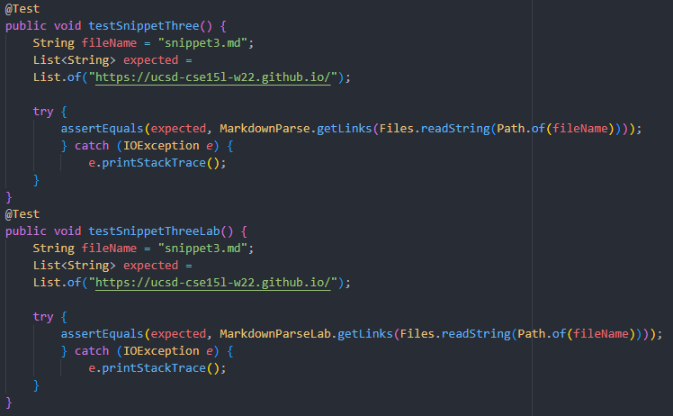

# Lab Report 4 - CSE 15L
## Markdown Parse Implementation
### Jordan Nishi A16201086

[Link to my Markdown Parse repository](https://github.com/jordan-nishi/markdown-parse)

[Link to Reviewed Markdown Parse](https://github.com/JaredJose/markdown-parse)
___

***for future self**: JUnit commands used*

javac -cp ".;lib\junit-4.13.2.jar;lib\hamcrest-core-1.3.jar" MarkdownParseTest.java

java -cp ".;lib/junit-4.13.2.jar;lib/hamcrest-core-1.3.jar" org.junit.runner.JUnitCore MarkdownParseTest

___

## Snippet 1

### Expected Output:
`google.com

### Test Code:

### Corresponding Output When Running Tests:

snippet1.md with MarkdownParse.java

snippet1.md with MarkdownParseJose.java

### Code Change Question:

**Do you think there is a small (<10 lines) code change that will make your program work for snippet 1 and all related cases that use inline code with backticks? If yes, describe the code change. If not, describe why it would be a more involved change.**

The problem here is that it expected [\`google.com] but got [url.com, \`google.com, google.com]. It seems like what's
happening here is that MarkdownParse.java is ignoring backticks (\`) surrounding links; instead, links that have backticks
interrupting them should be ignored. We should add some sort of check to not print links that have backtick markdown
in them.
___

## Snippet 2

### Expected Output:
a.com, a.com(()), example.com

### Test Code:

### Corresponding Output When Running Tests:

snippet2.md with MarkdownParse.java

snippet2.md with MarkdownParseJose.java

### Code Change Question:

**Do you think there is a small (<10 lines) code change that will make your program work for snippet 2 and all related cases that nest parentheses, brackets, and escaped brackets? If yes, describe the code change. If not, describe why it would be a more involved change.**

The problem here for my MarkdownParse.java is that we expected [a.com, a.com(()), example.com] but got [a.com, b.com, a.com((, example.com]. "b.com" is mistakenly being recognized as a valid link, but
should not because there is no `[]` before the `()`. Therefore, we should add a check for if there
is a set of brackets before the link in the parenthesis.

___

## Snippet 3

### Expected Output:
https://ucsd-cse15l-w22.github.io/

### Test Code:

### Corresponding Output When Running Tests:

snippet3.md with MarkdownParse.java

snippet3.md with MarkdownParseJose.java

### Code Change Question:

**Do you think there is a small (<10 lines) code change that will make your program work for snippet 3 and all related cases that have newlines in brackets and parentheses? If yes, describe the code change. If not, describe why it would be a more involved change.**

The problem here is that we expected [https://ucsd-cse15l-w22.github.io/] but got [https://www.twitter.com, https://ucsd-cse15l-w22.github.io/]. "https://www.twitter.com" should not be included
as there is a space between it and the parenthesis that looks like this `( https://www.twitter.com )`. Therefore, we should add a check to not include links when there are spaces such as these.
___

