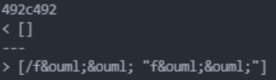
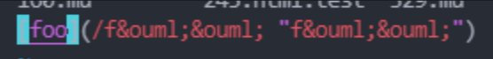
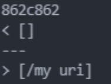
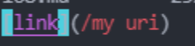

# Lab Report 5 - CSE 15L
## Commonmark-spec
### Jordan Nishi A16201086

To figure out if the tests had different results, we used the command `diff markdown-parse/results.txt joe-markdown-parse.txt`. This only showed differences between the two markdown parse outputs. However, since there were a lot of differences you can also search through it manually.

## Comparison #1

### Difference:

### Original File:

## Comparison #2

### Difference:

### Original File:

