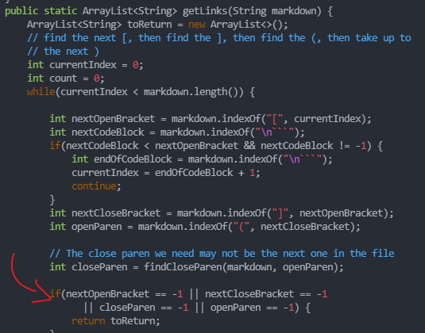

# Lab Report 5 - CSE 15L
## Commonmark-spec
### Jordan Nishi A16201086

To figure out if the tests had different results, we used the command `diff markdown-parse/results.txt joe-markdown-parse.txt`. This only showed differences between the two markdown parse outputs. However, since there were a lot of differences you can also search through it manually.

## Comparison #1

This was from line 492, test-files/32.md - Joe’s printed `[]` while mine printed `[/f&ouml;&ouml; "f&ouml;&ouml;"]`. It seems like mine was incorrect as the md file has spaces in the link, therefore it should not be considered a link. Additionally, there are quotes in the link which should not be there. A potential fix would to add a check to ensure that there are no quotes `""` within a link or spaces between the parenthesis `()`.

### Difference:

### Original File:

I think a potential fix could be in the getLinks() method around this area. Here we already check for missing brackets and parenthesis. We could add a check for quotes. If we find them, don't get the link.

## Comparison #2

Line 862, test-files/487.md - Joe’s printed `[]` while mine printed `[/my uri]`. Again, this should not be considered a link. It seems like mine was incorrect since the link has a space. A potential fix for this would be to add a check to make sure that there are no spaces in between parenthesis `()`.

### Difference:

### Original File:

I believe this fix could also be implemented around the same area as the last. We could add a check between the open parenthesis and closed parenthesis for any spaces. If we do, don't get the link.